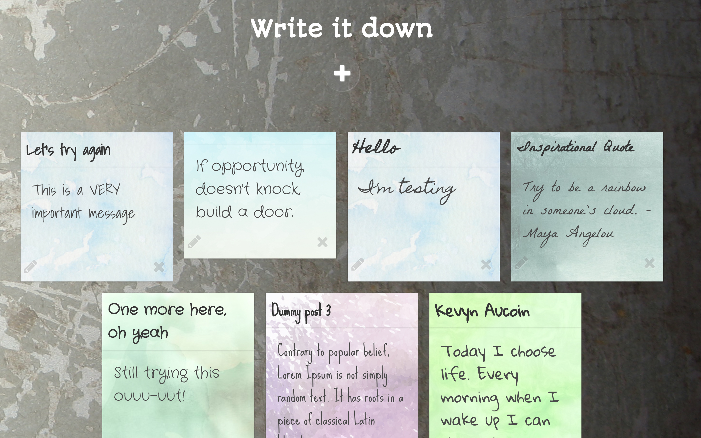

# Blog
> Single page app to create, edit and delete notes. Stores user input in a JSON objet and creates content dynamically.

Full-stack app without database. 
Users can write, edit and delete notes that appear on a randomized background with a custom font. 
Built with Bulma CSS framework.

